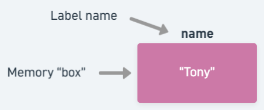

## 1.1: Overview

So, coding (roughly) allows you to write lines of variously levels of broken English to command a computer to do something for you. We can categorize these "somethings" into three categories:

| Action | Example | What Happened |
| --- | --- | --- |
| Assign a value | `name = "Tony"` | The text `Tony` is stored in a memory space labelled `name` |
| Do some evaluation | `print(math.sqrt(25))` | `print`s (outputs) the `sqrt` (square root) of 25 to the screen |
| Set up something | `for i in range(5):` | Sets up a `for` loop |

Now you don't need to understand what the examples mean (yet), but the point is, every line of code you write is either going to be assigning/resassigning values (manipulation), do something in the background (e.g. output to screen, do some math), or set up a large code chunk that does a task for you.

## 1.2: Assigning a value

Your device, whatever it may be, requires memory (space so to say) to store information, just like how we save information into a Google Doc or a notebook or our brains. For pretty much every langauge I know of, this memory manipulation requires two pieces of information:

1. What data are you storing?
2. What do you want to name the memory space?

Python needs to know what data to be storing into memory (1) in the first place, and how you would like to refer to the space of memory (2) so you can access it later. The two questions can get really specific depending on what language you are using (some languages will require you to designate the *amount* of memory to reserve or even the specific position). Thankfully, this process is simplified for you in Python: Python will deal with the messy details of where in memory to store something and how much to reserve.

However, this begs the question, how exactly do we answer these questions to Python, and how do we tell Python specifically that we want some data saved?

### 1.2.1: Assignment operator, `=`

No, we are not giving Python homework (though I suspect some of you will be using Python to do your homework at some point). When we say assignment, we mean we are assigning a *value* to a label (which points to a memory space). You can think about it as placing some data into a jar with a label on it. A very basic example is the example I showed earlier:

```{python}
name = "Tony"
```

Notice that this line does not produce output. All that code does is store the text `Tony` into a chunk of memory that has been labeled as `name`. Python will not necessarily have an output for every line that you run: it will do *exactly* as it's been told, no more no less. If you require there to be some output for you to see, you must specify so using an appropriate command (that will be discussed later).



::: {.trap-band}
**This is not an equality statement!** 

Comparisons of any sort have their own set of operators (symbols), and the `=` is not one of them despite its usage in mathematics to denote equality.
:::

### 1.2.2: The variable

This label is formally known as a *variable*. Variables are what you will be using to store data, whether it is a piece of data you create yourself or one that is derived from calculations.

::: {.trap-band}
**Order matters!**

The variable **must** be on the left-hand side of the assignment operator! Python always assumes whatever you write on the left-hand side to be the name of the variable you want to use, and whatever you write on the right-hand side to be the value.
:::

Note that the variable simply stores data: it is not necessarily permanent. In other words, you can switch what value is being stored by assigning a *different* value to the same variable:

```{python}
name = "Adolin"
```

Now within `name` is the text value of `Adolin`. The old text is thrown away (by background processes you don't have to worry about) since nothing else is claiming the old text.

<br/>


## 1.3: Expressions

So far, the right side has been a stand-alone value, namely (no pun intended) some text representing a name. However, the right-hand side is valid if whatever you write *evaluates* to a value:

```{python}
total = 1 + 2
```

Note that `1 + 2` does not really do anything by itself: it would create the value `3` and then the value would disappear since no code claims for anything else. Such code that evaluates (can be simplified) to a single value but does nothing if left alone in a line is what we call an *expression*. As long the right-hand side of an assignment operator is a valid expression, all will run well. There are some weird behaviors you may encounter depending on what you put on the right-hand side, but that is a discussion for later.

::: {.trap-band}
**Expressions only belong on the right-hand side of an assignment operator!** 

Python takes the left-hand side to be a *literal variable name*, but since an expression itself is not a value (it has to be evaluated first), Python will not be happy with you! An example of this is shown below.

```{python}
1 + 1 = 2
```
:::